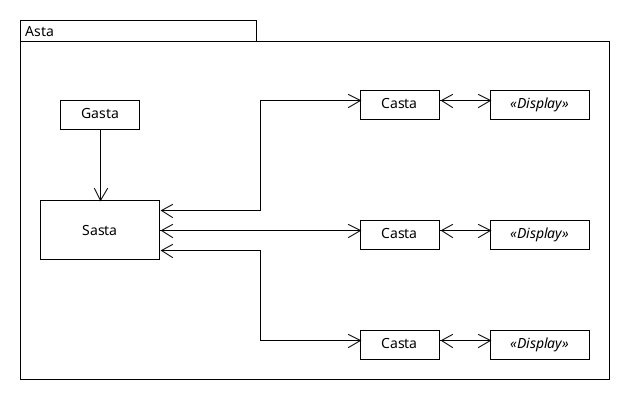

# Asta

Display manager with a client, a server with time-slot scheduling and a GUI for managing


Asta is composed of:

 - Sasta (Server)
 - Casta (Client)
 - Gasta (GUI for Sasta configuration)



## Build

```bash
docker buildx build --load -t <buildType>:latest . -f <buildType>/Dockerfile
```

With *buildType* being either sasta or gasta
