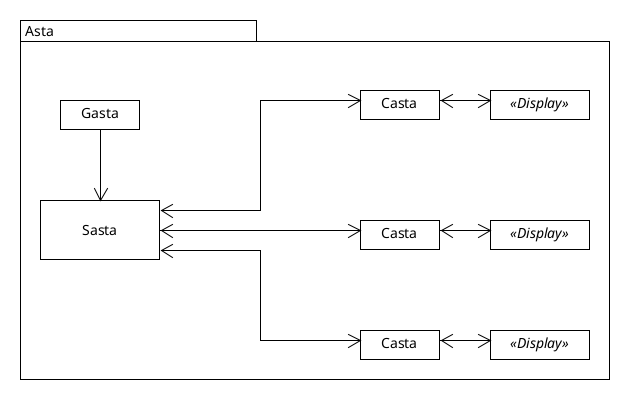

# Asta

Asta is a comprehensive display management system featuring a server with time-slot scheduling, a GUI for remote configuration, and a protocol for clients to render scheduled content.


## Project Components

Asta is composed of three main concepts:

- **Sasta (Server & Reference Client)**: The backend built in Rust. It provides the API, manages time-slot scheduling (using cron syntax), and serves the content. **Sasta now also hosts the reference client implementation as an htmx site**.
- **Casta (Protocol)**: Casta is a standardized protocol that any display client can implement to communicate with Sasta.
  > **Note**: The `casta/` folder at the project root contains **deprecated code**. It is left here for historical reasons. The current reference client implementation resides inside `sasta/`.
- **Gasta (GUI)**: A SvelteKit-based web application (powered by Deno) providing a graphical interface to easily manage Sasta's configurations, such as Displays, Schedules, and Playlists.



## 🛠 Local Development Setup

To make local development easy, Asta provides a helper script in the `dev/` directory that automatically allocates available ports and generates the necessary `.env` files for Sasta and Gasta.

### 1. Setup Environment

```bash
cd dev
cargo run
```

### 2. Start the Database (Redis)

Sasta requires a Redis stack server to store configurations. Using the `dev/` setup, run:

```bash
cd dev
docker compose up -d
# Or with Podman:
# podman-compose up -d
```

### 3. Run Sasta (Rust)

Navigate to the `sasta/` directory to run the server in development mode:

```bash
cd sasta
cargo run
# Or with automatic restart on a file change:
# cargo watch -x run
```

### 4. API Bindings Generation (Optional)

Gasta communicates with Sasta via typed API client bindings. The OpenAPI spec is served directly by the Sasta server, so to regenerate the bindings when the API changes, **Sasta must be running**:

1. Ensure Sasta is running (from step 3).
2. Generate the frontend TypeScript bindings for Gasta by fetching the live spec:
   ```bash
   cd gasta
   deno task gen:api
   ```

### 5. Run Gasta (Deno & SvelteKit)

Gasta has been migrated to Deno. Navigate to the `gasta/` directory and use the `dev` task to start the development server with hot-reloading:

```bash
cd gasta
# Install dependencies
deno install --allow-scripts

# Start the dev server
deno task dev
```

## 🚀 Production Build

For production use, you should build optimized container images. You can build these from the root of the repository. Podman can be used as a drop-in replacement for Docker:

### Build Sasta (Server & HTMX Client)

> **Note**: The build context must be the root directory because Sasta requires the `casta_protocol` folder to build.

```bash
docker build -t sasta:latest -f sasta/Dockerfile .
# Or with Podman:
# podman build -t sasta:latest -f sasta/Dockerfile .
```

### Build Gasta (GUI)

```bash
docker build -t gasta:latest -f gasta/Dockerfile .
# Or with Podman:
# podman build -t gasta:latest -f gasta/Dockerfile .
```
