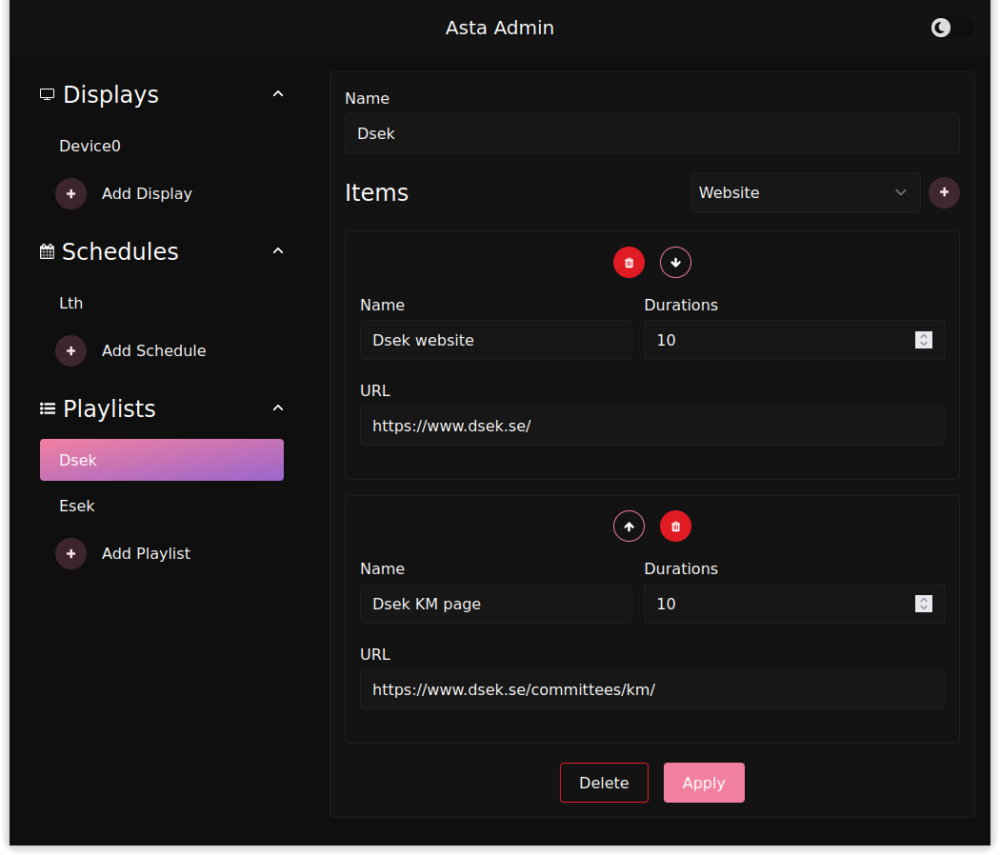

# GUI for Asta, aka Gasta

Gasta is a webapp build with SvelteKit to graphically use the Sasta API to Create, Update, Read or Delete Asta Displays, Schedules or Playlists.


# Image



# Build

```bash
pnpm i && pnpm run build
```

Then run the produced node server with

```bash
node build
```

The node server will not read .env file, see [SvelteKit Docs](https://kit.svelte.dev/docs/adapter-node#environment-variables)

# Docker

Example docker compose file:

```docker compose
gasta:
    image: <gasta image>
    ports:
      - "0.0.0.0:3000:3000"
    environment:
    # ORIGIN must be set to 
    # https://kit.svelte.dev/docs/adapter-node#environment-variables-origin-protocol-header-and-host-header
      - ORIGIN=<Where Gasta is hosted, example http://192.168.1.30:3000>
      - SERVER_URL=<Sasta URL>
```
